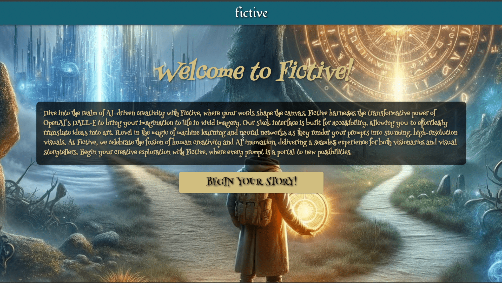

# Fictive: Choose Your Own Adventure App



## Inspiration

In the age of digital storytelling, children's literature needs to evolve. We noticed a gap in the market for interactive, personalized children's stories that leverage AI for a unique experience. Identifying key areas for improvement:

- **Static Storylines:** Traditional books offer no interactivity, which is less engaging for the digital-savvy young generation.
- **One-Size-Fits-All:** Most stories are not tailored to individual preferences or developmental stages.
- **Lack of Visual Customization:** Visual elements in existing children's books cannot be altered to match the child's imagination or visual preferences.


> Insert a brief video walkthrough or image gallery showcasing the app here

## What It Does

"Fictive" is a groundbreaking choose-your-own-adventure app that addresses these challenges head-on. It allows for a high degree of personalization in story creation, thanks to the integration of advanced AI models like DALL-E and GPT-4. Here's what it offers:

1. **Interactive Storytelling:** Children or parents can make choices that influence the story's direction.
2. **AI-Generated Content:** Our app uses AI to craft stories that adapt to a child's interests and developmental needs.
3. **Visual and Textual Customization:** Users can select illustrations, backgrounds, and animations to visually enrich the storytelling experience.

<p float="left">
  
   
  
</p>

Click on the image to view the video:
[](https://youtu.be/WJGW4LrhAOw")

## Getting Started

To run Fictive on your local machine, follow these steps:

### Prerequisites

- Git
- Node.js
- npm (comes with Node.js)
- Python
- Flask

### Installation

First, clone the repository:

```bash
git clone https://github.com/your-username/fictive.git
cd fictive
```

To set up the frontend, run:
```bash
# Navigate to the frontend directory
cd frontend

# Install dependencies
npm install

# Start the React app
npm run start
```

Open a new terminal window for the backend setup:

```bash
# Navigate to the backend directory
cd backend

# Install Flask (if you don't have it already)
pip install Flask

# Run the Flask server
python run app.py
```

The app should now be running on localhost in your web browser.

For any additional help or to report issues, please open an issue in the GitHub repository.
Happy storytelling with Fictive!
